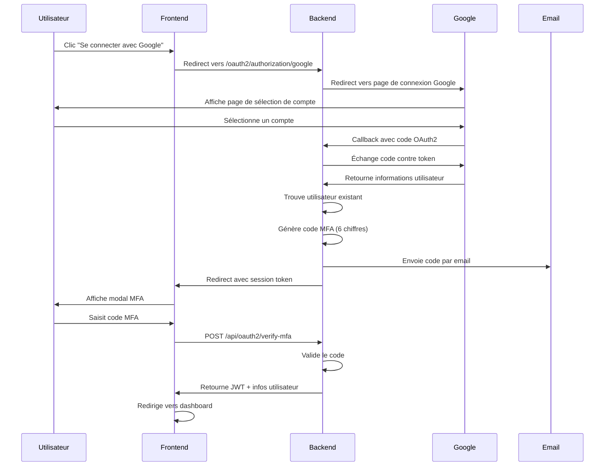
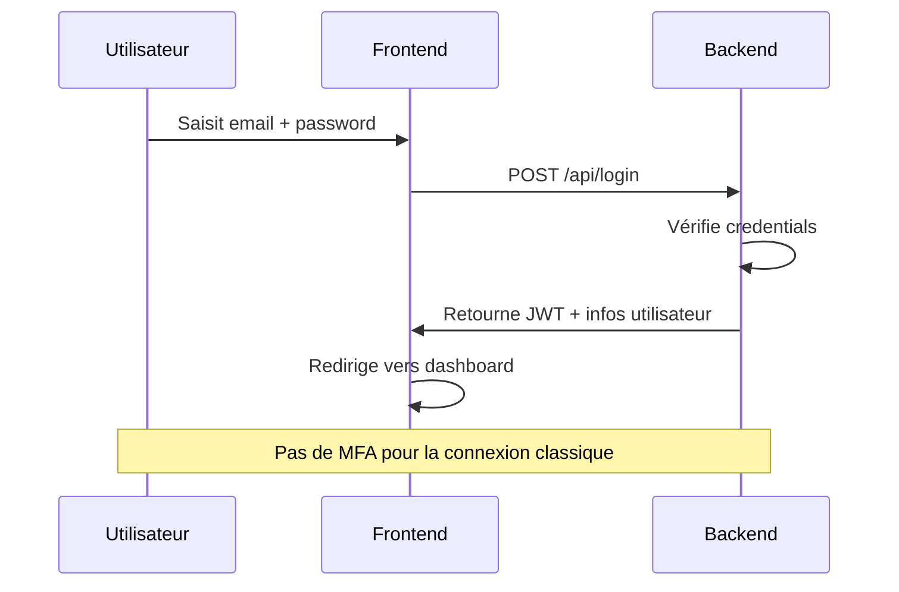

# 🔐 Guide de Configuration OAuth2 + MFA

Ce document explique comment configurer et utiliser l'authentification OAuth2 avec Google et la vérification MFA (Multi-Factor Authentication) dans l'application Moustass Video.

## 📋 Table des matières

1. [Vue d'ensemble](#vue-densemble)
2. [Prérequis](#prérequis)
3. [Configuration Google OAuth2](#configuration-google-oauth2)
4. [Configuration de l'email SMTP](#configuration-de-lemail-smtp)
5. [Configuration de l'application](#configuration-de-lapplication)
6. [Migration de la base de données](#migration-de-la-base-de-données)
7. [Flux d'authentification](#flux-dauthentification)
8. [Tests](#tests)
9. [Dépannage](#dépannage)

---

## 🎯 Vue d'ensemble

L'application implémente un système d'authentification sécurisé avec deux modes :

1. **Authentification classique** : Email + Mot de passe (sans MFA)
2. **Authentification OAuth2 Google** : Connexion via Google + Vérification MFA obligatoire par email

### Fonctionnalités clés

- ✅ Connexion OAuth2 avec Google
- ✅ Création automatique de compte pour les nouveaux utilisateurs OAuth2
- ✅ Vérification MFA par code à 6 chiffres envoyé par email
- ✅ Expiration des codes MFA (10 minutes par défaut)
- ✅ Renvoi de code MFA en cas de besoin
- ✅ Interface utilisateur moderne avec modal MFA
- ✅ Tests unitaires complets (coverage maintenu à 81%+)

---

## 🛠️ Prérequis

- Java 17+
- Spring Boot 3.5.9
- MySQL
- Node.js 18+ (pour le frontend React)
- Un compte Google Cloud Platform
- Un serveur SMTP (Gmail, SendGrid, etc.)

---

## 🔑 Configuration Google OAuth2

### Étape 1 : Créer un projet Google Cloud

1. Accédez à [Google Cloud Console](https://console.cloud.google.com/)
2. Créez un nouveau projet ou sélectionnez un projet existant

### Étape 2 : Activer Google+ API

1. Dans le menu de navigation, allez dans **APIs & Services** > **Library**
2. Recherchez "Google+ API"
3. Cliquez sur **Enable**

### Étape 3 : Configurer l'écran de consentement OAuth

1. Allez dans **APIs & Services** > **OAuth consent screen**
2. Sélectionnez **External** (ou Internal si votre organisation G Suite)
3. Remplissez les informations requises :
   - **App name** : Moustass Video
   - **User support email** : Votre email
   - **Developer contact information** : Votre email
4. Ajoutez les scopes nécessaires :
   - `userinfo.email`
   - `userinfo.profile`
5. Sauvegardez et continuez

### Étape 4 : Créer les credentials OAuth2

1. Allez dans **APIs & Services** > **Credentials**
2. Cliquez sur **Create Credentials** > **OAuth 2.0 Client ID**
3. Sélectionnez **Web application**
4. Configurez :
   - **Name** : Moustass Video OAuth2
   - **Authorized JavaScript origins** :
     - `http://localhost:8082`
     - `http://localhost:5173` (frontend React)
   - **Authorized redirect URIs** :
     - `http://localhost:8082/login/oauth2/code/google`
5. Cliquez sur **Create**
6. **IMPORTANT** : Copiez le **Client ID** et **Client Secret** générés

### Étape 5 : Configuration en production

Pour un environnement de production, ajoutez vos URLs de production :

- **Authorized JavaScript origins** : `https://votre-domaine.com`
- **Authorized redirect URIs** : `https://votre-domaine.com/login/oauth2/code/google`

---

## 📧 Configuration de l'email SMTP

L'application utilise SMTP pour envoyer les codes MFA. Voici des exemples de configuration pour différents fournisseurs.

### Option 1 : Gmail

1. Activez l'authentification à deux facteurs sur votre compte Google
2. Générez un mot de passe d'application :
   - Allez dans **Compte Google** > **Sécurité** > **Mots de passe d'application**
   - Générez un nouveau mot de passe pour "Mail"
3. Utilisez ces paramètres :
   ```properties
   MAIL_HOST=smtp.gmail.com
   MAIL_PORT=587
   MAIL_USERNAME=votre-email@gmail.com
   MAIL_PASSWORD=votre-mot-de-passe-application
   ```

### Option 2 : SendGrid

```properties
MAIL_HOST=smtp.sendgrid.net
MAIL_PORT=587
MAIL_USERNAME=apikey
MAIL_PASSWORD=votre-api-key-sendgrid
```

### Option 3 : Mailgun

```properties
MAIL_HOST=smtp.mailgun.org
MAIL_PORT=587
MAIL_USERNAME=postmaster@votre-domaine.mailgun.org
MAIL_PASSWORD=votre-mot-de-passe-mailgun
```

---

## ⚙️ Configuration de l'application

### Fichier `application.properties`

Créez ou modifiez le fichier `src/main/resources/application.properties` :

```properties
# Configuration OAuth2 Google
spring.security.oauth2.client.registration.google.client-id=${GOOGLE_CLIENT_ID}
spring.security.oauth2.client.registration.google.client-secret=${GOOGLE_CLIENT_SECRET}
spring.security.oauth2.client.registration.google.redirect-uri=${OAUTH2_REDIRECT_URI:http://localhost:8082/login/oauth2/code/google}

# Configuration Email SMTP
spring.mail.host=${MAIL_HOST:smtp.gmail.com}
spring.mail.port=${MAIL_PORT:587}
spring.mail.username=${MAIL_USERNAME}
spring.mail.password=${MAIL_PASSWORD}

# Configuration MFA
mfa.code.expiration.minutes=${MFA_CODE_EXPIRATION:10}
mfa.code.length=${MFA_CODE_LENGTH:6}

# Frontend origin (pour CORS et redirections)
app.frontend.origin=${REACT_HOST:http://localhost}:${REACT_PORT:5173}
```

### Variables d'environnement

Créez un fichier `.env` à la racine du projet backend :

```bash
# OAuth2 Google
GOOGLE_CLIENT_ID=votre-client-id.apps.googleusercontent.com
GOOGLE_CLIENT_SECRET=votre-client-secret

# Email SMTP
MAIL_HOST=smtp.gmail.com
MAIL_PORT=587
MAIL_USERNAME=votre-email@gmail.com
MAIL_PASSWORD=votre-mot-de-passe-application

# MFA (optionnel, valeurs par défaut)
MFA_CODE_EXPIRATION=10
MFA_CODE_LENGTH=6

# Database (si nécessaire)
DB_HOST=localhost
DB_PORT=3306
DB_NAME=moustass_video
DB_USER=root
DB_PASSWORD=root

# JWT Secret (au moins 32 caractères)
JWT_SECRET=VotreSuperSecretJWTQuiFaitAuMoins32Caracteres!

# Vault
VAULT_TOKEN=votre-vault-token
```

### Configuration du frontend

Créez ou modifiez le fichier `front/react-api-app/.env` :

```bash
VITE_API_URL=http://localhost:8082
```

---

## 🗄️ Migration de la base de données

Exécutez le script SQL de migration pour ajouter les colonnes nécessaires à la base de données :

```bash
mysql -u root -p moustass_video < database/migrations/V2__add_oauth2_mfa_support.sql
```

Ou exécutez manuellement les commandes SQL :

```sql
-- Ajout des colonnes OAuth2 à la table users
ALTER TABLE users
ADD COLUMN oauth_provider VARCHAR(50) NULL,
ADD COLUMN oauth_provider_id VARCHAR(255) NULL,
ADD INDEX idx_oauth_provider (oauth_provider, oauth_provider_id);

-- Création de la table mfa_codes
CREATE TABLE IF NOT EXISTS mfa_codes (
    id BIGINT AUTO_INCREMENT PRIMARY KEY,
    user_id INT NOT NULL,
    code VARCHAR(6) NOT NULL,
    expires_at DATETIME NOT NULL,
    is_used TINYINT(1) NOT NULL DEFAULT 0,
    session_token VARCHAR(255) NOT NULL UNIQUE,
    created_at DATETIME NOT NULL DEFAULT CURRENT_TIMESTAMP,
    
    INDEX idx_user_id (user_id),
    INDEX idx_expires_at (expires_at),
    INDEX idx_session_token (session_token),
    
    CONSTRAINT fk_mfa_user FOREIGN KEY (user_id) REFERENCES users(id) ON DELETE CASCADE
) ENGINE=InnoDB DEFAULT CHARSET=utf8mb4;
```

---

## 🔄 Flux d'authentification

### Scénario 1 : Nouvel utilisateur OAuth2


### Scénario 2 : Utilisateur OAuth2 existant



### Scénario 3 : Connexion classique (Email/Password)



---

## 🧪 Tests

### Exécuter tous les tests

```bash
# Backend
mvn clean test

# Avec coverage JaCoCo
mvn clean test jacoco:report

# Frontend
cd front/react-api-app
npm test
```

### Vérifier le coverage

```bash
# Le rapport JaCoCo sera généré dans :
target/site/jacoco/index.html

# Ou visualisez sur SonarCloud
mvn sonar:sonar -Dsonar.projectKey=votre-project-key
```

### Tests manuels

1. **Test OAuth2 + MFA** :
   - Cliquez sur "Se connecter avec Google"
   - Sélectionnez un compte Google
   - Vérifiez la réception de l'email avec le code MFA
   - Saisissez le code dans le modal
   - Vérifiez la redirection vers le dashboard

2. **Test création automatique de compte** :
   - Utilisez un compte Google qui n'existe pas encore en base
   - Vérifiez que le compte est créé automatiquement
   - Vérifiez que l'utilisateur a `isAdmin = false`

3. **Test expiration de code MFA** :
   - Ne saisissez pas le code pendant 10 minutes
   - Essayez de valider un code expiré
   - Vérifiez le message d'erreur

4. **Test renvoi de code MFA** :
   - Cliquez sur "Renvoyer le code"
   - Vérifiez la réception d'un nouveau code
   - Validez avec le nouveau code

---

## 🔧 Dépannage

### Problème : "Email server error"

**Symptôme** : Le code MFA n'est pas envoyé

**Solutions** :
1. Vérifiez les credentials SMTP dans `.env`
2. Pour Gmail, assurez-vous d'utiliser un mot de passe d'application
3. Vérifiez que le port SMTP est correct (587 pour TLS)
4. Vérifiez les logs backend : `tail -f logs/application.log`

### Problème : "Redirect URI mismatch"

**Symptôme** : Erreur lors de la redirection OAuth2

**Solutions** :
1. Vérifiez que l'URI de redirection dans Google Cloud Console correspond exactement :
   - Dev : `http://localhost:8082/login/oauth2/code/google`
   - Prod : `https://votre-domaine.com/login/oauth2/code/google`
2. Pas de slash "/" à la fin de l'URI
3. Respectez la casse (minuscules)

### Problème : "Session MFA introuvable"

**Symptôme** : Erreur lors de la vérification du code MFA

**Solutions** :
1. Vérifiez que la table `mfa_codes` existe en base
2. Le code MFA expire après 10 minutes, demandez un nouveau code
3. Vérifiez que le session token est correctement transmis

### Problème : "CORS error"

**Symptôme** : Erreur CORS dans la console du navigateur

**Solutions** :
1. Vérifiez que `app.frontend.origin` est correctement configuré dans `application.properties`
2. En dev, assurez-vous que `http://localhost:5173` est autorisé
3. Redémarrez le backend après modification de la configuration

### Problème : Code MFA non reçu

**Solutions** :
1. Vérifiez le dossier spam de votre boîte mail
2. Vérifiez les logs backend pour voir si l'email a été envoyé
3. Testez l'envoi d'email avec un outil comme Mailtrap en développement

---

## 📚 Ressources supplémentaires

- [Documentation Spring Security OAuth2](https://docs.spring.io/spring-security/reference/servlet/oauth2/index.html)
- [Google OAuth2 Documentation](https://developers.google.com/identity/protocols/oauth2)
- [Spring Mail Documentation](https://docs.spring.io/spring-framework/reference/integration/email.html)

---

## 📝 Notes importantes

1. **Sécurité** :
   - Ne commitez JAMAIS vos credentials (client secret, passwords) dans Git
   - Utilisez des variables d'environnement pour toutes les informations sensibles
   - En production, utilisez un gestionnaire de secrets (Vault, AWS Secrets Manager, etc.)

2. **MFA uniquement pour OAuth2** :
   - Le MFA s'applique UNIQUEMENT aux connexions via "Se connecter avec Google"
   - Les connexions classiques (email/password) ne déclenchent PAS de MFA
   - Cette conception est intentionnelle selon les spécifications du projet

3. **Nettoyage automatique** :
   - Les codes MFA expirés sont automatiquement supprimés toutes les heures
   - Les codes utilisés sont également supprimés automatiquement

4. **Performance** :
   - Les index sur la table `mfa_codes` optimisent les requêtes
   - Le nettoyage automatique évite l'accumulation de données inutiles

---

## 🎉 Félicitations !

Vous avez maintenant une authentification OAuth2 + MFA totalement fonctionnelle et sécurisée !

Pour toute question ou problème, consultez les logs de l'application ou créez une issue sur le repository GitHub.
